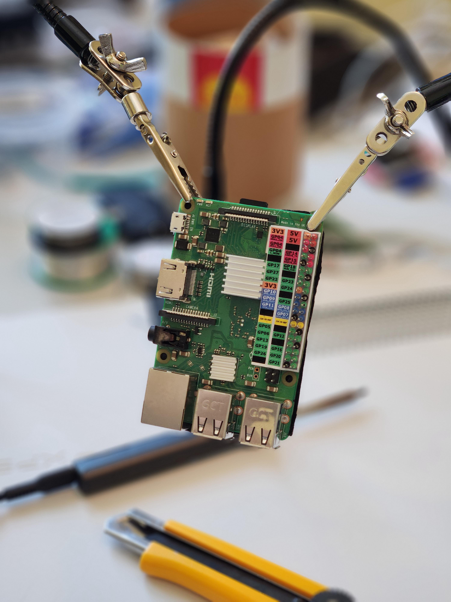

# RaspberryPi-GPIO-Label

A small little printable label that can be pushed onto the pins of a Raspberry Pi 40-pin header

Print the PDF at 100% size, which includes two versions:

- one has the labels on each side of the headers,
- one has them all on the interior of the board, useful if the board edge is flush up against something like a case.

## Customizing

Grab the SVG and edit/replicate to your heart's content!
